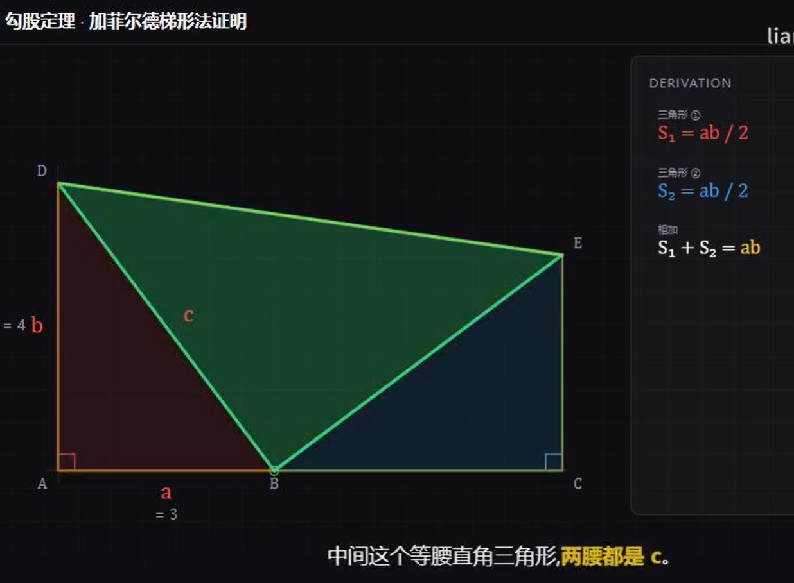

# Geometry Math Proof Remotion

> 精准几何风格的数学证明视频生成 skill。深底高饱和配色 + SVG 代码绘制 + 公式逐步揭示 + 字幕驱动时间轴。3Blue1Brown / 可汗学院风格。

本 skill 把数学证明文档(勾股定理、欧拉公式、积分、几何推导、代数恒等式…)自动转成 1920×1080 @ 30fps 的 Remotion 视频。几何元素全部用代码绘制,公式逐行揭示,字幕以真实 TTS 时长驱动时间轴。

---


## 怎样配置使用

在 codex,claude code, workbuddy 等 Agent 命令AI：

❯ 安装skill: https://github.com/liangdabiao/geometry-math-proof-remotion
 ，然后需要安装好 remotion。

配置好，就可以开始使用了。

在codex,claude code, workbuddy:

❯ geometry-math-proof-remotion skill 制作视频：证明勾股定理

demo例子：


https://www.bilibili.com/video/BV1jgKH6qEu5/

## 目录

- [项目结构](#项目结构)
- [核心特性](#核心特性)
- [快速开始](#快速开始)
- [依赖清单](#依赖清单)
- [新一集工作流](#新一集工作流)
- [模板项目说明](#模板项目说明)
- [风格 DNA](#风格-dna)
- [常见坑](#常见坑)
- [参考资料](#参考资料)
- [许可证](#许可证)

---

## 项目结构

```
geometry-math-proof-remotion/
├── SKILL.md                                # Skill 主文档(Claude 读取,理解工作流)
├── README.md                               # 本文件(人类阅读,详细说明)
│
├── references/                             # 详细模式参考
│   ├── composition-patterns.md             # SVG 描边、坐标变换、FormulaPanel、CAPTIONS 模式
│   └── jsx-unicode-pitfalls.md             # TS1351 Unicode 陷阱 + Edit 工具坑
│
├── scripts/                                # 跨项目脚本
│   └── fetch_article.py                    # 微信公众号文章 → markdown + 下载原文图
│
└── templates/                              # 视频工程模板
    └── remotion-project/                   # Remotion 4.0 模板
        ├── package.json
        ├── remotion.config.ts
        ├── tsconfig.json
        ├── requirements.txt                # Python 依赖清单
        ├── .env.example                    # 环境变量模板
        ├── .gitignore
        ├── src/
        │   ├── Root.tsx                    # Composition 根
        │   ├── index.ts                    # registerRoot 入口
        │   ├── Proof.tsx                   # 主合成组件(改这里实现具体证明)
        │   ├── geometry.tsx                # 颜色/字体/帧工具/SVG 坐标变换
        │   ├── formula-panel.tsx           # 右侧公式面板
        │   ├── caption-strip.tsx           # 底部字幕条
        │   ├── hooks-overlay.tsx           # 片头/片尾全屏遮罩
        │   └── top-bar.tsx                 # 顶部信息条
        ├── scripts/
        │   └── generate_tts.py             # MiniMax TTS + 字幕时间轴生成
        ├── public/                         # 静态资产(运行时填充)
        │   └── assets/
        │       ├── audio/                  # TTS 输出的 voice.mp3
        │       └── article-images/         # 抓的公众号原文图
        ├── work/                           # 中间产物
        │   ├── source/                     # 稿子 + 抓回来的 markdown
        │   ├── audio/generated/            # TTS 分段 mp3
        │   └── captions/                   # captions_aligned.json + captions.srt
        └── renders/                        # 渲染输出
            ├── preview-low.mp4             # 0.5x 预览版
            └── final-1080p.mp4             # 1.0x 1080p 成片
```

---

## 核心特性

- **深底高饱和配色** — `#0d0d12` 深底,红/蓝/绿/黄四主色精确控场
- **代码绘几何** — 所有图形 SVG + stroke-dasharray 描边动画,无任何位图/图标库/emoji
- **公式逐步揭示** — 右侧面板按口播节奏逐行淡入,关键变量黄色高亮,最终结论黄框大字
- **字幕驱动时间轴** — TTS 真实时长回写 F 帧,避免"口播三句话完事"
- **章节聚焦暗化** — 当前章元素 1.0 透明度,其他章节 0.45 暗化
- **历史/人物署名** — 收尾卡 Q.E.D. + 历史/作者/年代,3Blue1Brown 风格

---

## 快速开始

### 1. 准备环境

| 工具 | 版本要求 | 用途 |
|---|---|---|
| Node.js | ≥ 18.0.0 | Remotion 运行时 |
| Python | ≥ 3.8 | TTS 脚本 |
| Google Chrome | 最新 | Remotion 渲染浏览器(必须 Chrome,Edge 不行) |
| FFmpeg | ≥ 4.0 | 音频拼接 + 测量时长(`ffmpeg`/`ffprobe` 命令) |
| Pillow | ≥ 10.0 | 公众号文章抓图 |
| requests | ≥ 2.31 | HTTP 客户端 |
| MiniMax API Key | — | TTS 服务凭据(`speech-2.8-hd`) |

### 2. 复制模板创建新一集

```bash
mkdir "<VIDEO_WORKSPACE>/<new-proof-name>"
cp -R "./templates/remotion-project/"* "<VIDEO_WORKSPACE>/<new-proof-name>/"
cd "<VIDEO_WORKSPACE>/<new-proof-name>"

# ⚠️ 用原生 npm install,不要 rtk npm install(rtk 会翻译成 npm run install 报错)
npm install

# 配置凭据
cp .env.example .env
# 编辑 .env 填入 MiniMax API Key
```

### 3. 编写稿子(分章节 + LINES)

`work/source/script.md` 中按"钩子 → 准备 → 推导 1~N → 消项 → 收尾"拆 6~10 章。每章先列 beat checklist(变量定义/几何构造/面积计算/代数化简),再写 LINES。

### 4. 跑 TTS + 回写时间轴

```bash
# 默认自动选择:有 minimaxi=xxx 配 → 用 MiniMax(高质量),否则用 edge(免费)
python scripts/generate_tts.py

# 强制指定 provider
python scripts/generate_tts.py --provider edge       # edge 免费
python scripts/generate_tts.py --provider minimax    # MiniMax(需 .env 中配 minimaxi=)

# 列出 edge 可用中文 voice
python scripts/generate_tts.py --list-voices
```

**TTS Provider 选择**:

| Provider | 成本 | 质量 | 联网 | 适用场景 |
|---|---|---|---|---|
| **edge**(默认) | 免费 | 高(微软神经网络) | 必需 | 快速出片、零成本、测试稿 |
| **minimax** | 付费 | 高(MiniMax speech-2.8-hd) | 必需 | 成片、对音色有特定要求 |

- **edge(默认免费)**:基于 Microsoft Edge 在线 TTS(`edge-tts` Python 库)。无需 API Key,需联网。中文推荐 `zh-CN-XiaoxiaoNeural`(晓晓,女声)或 `zh-CN-YunyangNeural`(云扬,男声新闻/旁白风)。在 `.env` 设 `EDGE_VOICE=...` 或命令行 `--edge-voice ...`。
- **MiniMax(可选)**:基于 `speech-2.8-hd`,音色 `moss_audio_2ecaeaac-5e5a-11f1-99fb-96e792fde6a1`,需在 `.env` 配 `minimaxi=<your-key>`。

**自动 fallback 规则**:`--provider` 命令行 > `.env` 中 `TTS_PROVIDER` > 有 `minimaxi=xxx` 配 → minimax > 默认 edge。

产出:
- `public/assets/audio/voice.mp3` — 整段配音
- `work/captions/captions_aligned.json` — Remotion 时间轴来源(总帧数 + 每行 start/end)
- `work/captions/captions.srt` — 标准 SRT 字幕

把 `captions_aligned.json` 的 `total_frames` 回写到 `src/Root.tsx` 的 `durationInFrames`,把每行末帧写到 `src/geometry.tsx` 的 `F` 对象。

### 5. 改 `Proof.tsx`

- 几何坐标:`const A = pt(0,0), B = pt(3,0)…`
- CAPTIONS:从 `captions_aligned.json` 拆关键词(标 `tone: 'accent'`)
- STEPS:`FormulaStep[]`,`from` 锚到对应章节中段
- HookOverlay / EndingOverlay 的 title/result 用大字公式,attribution 写历史/人物

### 6. 验证循环

```bash
# TS 类型检查
npx tsc --noEmit

# 启动 Studio 实时预览
npm run studio
# 浏览器访问 http://localhost:3000

# 出低分辨率预览版
npm run render:preview
# → renders/preview-low.mp4
# 用户确认后再出 1080p 成片
npm run render
# → renders/final-1080p.mp4
```

---

## 依赖清单

### Node.js 依赖(`package.json`)

| 包 | 版本 | 用途 |
|---|---|---|
| `remotion` | 4.0.484 | Remotion 核心库 |
| `@remotion/media` | 4.0.484 | `<Audio>` 推荐来源(Mediabunny 后端,比 `<Html5Audio>` 同步更准) |
| `react` | 19.1.0 | UI 框架 |
| `react-dom` | 19.1.0 | DOM 渲染 |
| `@remotion/cli` | 4.0.484(dev) | CLI 工具(studio/render) |
| `@types/node` | 24.0.10(dev) | Node 类型 |
| `@types/react` | 19.1.8(dev) | React 类型 |
| `@types/react-dom` | 19.1.6(dev) | React DOM 类型 |
| `typescript` | 5.8.3(dev) | TS 编译器 |

### Python 依赖(`requirements.txt`)

```
requests>=2.31.0
Pillow>=10.0.0
```

### 系统工具(必须)

- **Google Chrome** — Windows 默认 `C:\Program Files\Google\Chrome\Application\chrome.exe`。Remotion 在中国大陆默认会卡在 `storage.googleapis.com` 下载 Chrome Headless Shell,改用系统 Chrome(Edge 不行,Remotion 用了旧 headless flag 而 Edge 已移除)。
- **FFmpeg + ffprobe** — 用于音频拼接(`ffmpeg -f concat`)和时长测量(`ffprobe -show_entries format=duration`)。

### 环境变量(`.env`)

```bash
# === TTS Provider 开关(可选 edge|minimax,默认 auto) ===
TTS_PROVIDER=edge

# === MiniMax TTS API Key(可选,不填自动用 edge 免费方案) ===
# 获取:https://api.minimaxi.com 控制台
minimaxi=your_api_key_here

# === Edge TTS voice(可选,默认 zh-CN-XiaoxiaoNeural) ===
EDGE_VOICE=zh-CN-XiaoxiaoNeural
```

---

## 新一集工作流

> 完整流程详见 [SKILL.md](./SKILL.md),这里是浓缩版。

1. **读源文档** — 把证明拆成 6~10 个章节,每章一个视觉主意
2. **列 beat checklist** — 变量定义/几何构造/面积计算/代数化简,防止跳步
3. **写 LINES + 跑 TTS** — `python scripts/generate_tts.py`,产出 `captions_aligned.json`
4. **回写 F 时间轴** — 把 `total_frames` 写到 `Root.tsx`,每章末帧写到 `geometry.tsx` 的 `F`
5. **改 `Proof.tsx`** — 几何坐标/CAPTIONS/STEPS/HookOverlay/EndingOverlay
6. **验证循环** — `npx tsc --noEmit` + Studio 实时预览 + 静帧抽查 + 关键词同步检查
7. **两段式渲染** — `npm run render:preview` 出 0.5x 给用户确认,再 `npm run render` 出 1080p 成片

---

## 模板项目说明

### 模板定位

`templates/remotion-project/` 是**骨架工程**,演示如何把通用组件拼起来。**它不是最终视频**。实际证明需要:

1. 改 `Proof.tsx` 中的几何坐标、CAPTIONS、STEPS、TopBar 信息
2. 改 `Root.tsx` 的 `durationInFrames` 为 TTS 真实总帧
3. 改 `geometry.tsx` 的 `F` 对象为各章节帧锚点

### 风格锁定文件(不要改)

- `src/geometry.tsx` — 调色板/字体栈/帧工具/SVG 坐标变换
- `src/formula-panel.tsx` — 右侧公式面板
- `src/caption-strip.tsx` — 底部字幕条
- `src/hooks-overlay.tsx` — 片头/片尾遮罩
- `src/top-bar.tsx` — 顶部信息条

如需新组件,在新文件里加,不要改通用文件。

### 占位 Proof.tsx

当前 `Proof.tsx` 是**占位实现**:
- 几何:单位三角形示例(`A=pt(0,0) B=pt(3,0) D=pt(0,4)`)
- CAPTIONS:单条示例字幕
- STEPS:两条示例公式步骤
- 整段 1500 帧(50 秒),TTS 未跑前的兜底时长

实际证明请用真实章节内容替换。

---

## 风格 DNA(不可变)

| 项 | 值 |
|---|---|
| 画布 | 1920×1080 @ 30fps,深底 `#0d0d12` |
| 配色 | 红 `#e74c3c`、蓝 `#3498db`、绿 `#2ecc71`、黄 `#f1c40f`(黄=最终结论/钩子) |
| 字体 | 数学衬线 `Cambria Math`/`STIX Two Math`,中文 `PingFang SC`/`Microsoft YaHei` |
| 几何 | SVG `viewBox 0 0 1100 860`,坐标变换 `pt(gx,gy)`,单位 `SCALE=130px/单位` |
| 描边 | 一切线框都用 `strokeDasharray`+`strokeDashoffset` 做"被画出来"动画 |
| 动画 | `fadeIn`/`drawIn`/`fadeOut`,缓动统一 `bezier(0.4,0,0.2,1)`,**没有**弹跳/旋转/滑入 |
| 字幕 | 底部 110px 字幕条,关键词 `tone:'accent'` 黄色加粗高亮 |
| 公式 | 右侧 700×820 面板,逐步揭示;最终结论用黄框大字(`tone:'result'`) |
| 素材 | 全部代码绘制,不用任何位图/图标库/emoji |
| 配音 | 默认 edge-tts(`zh-CN-XiaoxiaoNeural` 晓晓),1.2x 语速。可选 MiniMax `speech-2.8-hd`,voice_id `moss_audio_2ecaeaac-5e5a-11f1-99fb-96e792fde6a1` |

---

## 常见坑

### 1. JSX 中 `²` `₁₂₃` 触发 TS1351

**症状**:`npx tsc --noEmit` 报 `error TS1351: An identifier or keyword cannot immediately follow a numeric literal`。

**根因**:Unicode No 类字符(上标/下标/分数符号)被 TS 解析为数字字面量一部分,在 JSX 文本位置报错。

**解法**:所有含 Unicode 数字符号的 JSX 文本一律包字符串表达式:

```tsx
// ❌ 错误
<span>a² + b² = c²</span>

// ✅ 正确
<span>{'a² + b² = c²'}</span>
```

详见 [references/jsx-unicode-pitfalls.md](./references/jsx-unicode-pitfalls.md)。

### 2. Edit 工具找不到含 Unicode 的字符串

Edit 工具对 `²` 等 Unicode 字符匹配不稳定。改用 Python `str.replace` 或整文件 `Write` 重写。

### 3. Remotion 在中国卡 storage.googleapis.com

`remotion.config.ts` 必须设 `Config.setBrowserExecutable(<系统 Chrome 路径>)`。Edge 不行,Remotion 用了旧 headless flag 而 Edge 已移除。

### 4. 字幕驱动 frames,不要凭口播猜帧数

先跑 TTS 拿真实时长再回写 F,不要凭"我估计 30 秒"瞎填。

### 5. preview-low → final-1080p 两段式

先 `npm run render:preview` 出 0.5x 给用户确认,再 `npm run render` 出 1080p 成片。1080p 渲染 1 分钟视频要十几分钟,返工成本太高。

### 6. `rtk npm install` 失败

用原生 `npm install`。`rtk` 会把 `npm install` 翻译成 `npm run install`,而 `package.json` 里没这个 script。

### 7. SVG 透明穿透导致多章节图形重叠

所有章节渲染器用 `position: absolute` 叠在同一坐标,每个用 `fadeIn` 从 0 淡入到 1 但从不淡出。SVG 画布本身全透明,前章节图形会透过当前章节的透明区域露出来。**必须用条件渲染**,每章只在自己的帧范围挂载:

```tsx
{frame >= F.circuit - 30 && frame < F.liveNeutral && <RenderCircuit frame={frame}/>}
{frame >= F.switch - 30 && frame < F.fuse && <RenderSwitch frame={frame}/>}
```

不要用 `opacity` 控制章节可见性,要用 `React mount/unmount`。

---

## 微信公众号文章特别处理

如果源文档是微信公众号文章,先用 `scripts/fetch_article.py` 抓回 markdown:

```bash
python scripts/fetch_article.py \
  --url "https://mp.weixin.qq.com/s/xxx" \
  --out-dir .
```

输出:
- `work/source/article.md` — 抓回的 markdown
- `work/source/images.json` — 图片清单(含宽高比)
- `public/assets/article-images/img-NN.jpg` — 原文图(统一转 jpg)

依赖 ideaflow API(`https://ideaflow-article-to-markdown.hf.space/resolve/mark`)。

---

## 参考资料

- [SKILL.md](./SKILL.md) — Skill 主文档(Claude 优先读这个)
- [references/composition-patterns.md](./references/composition-patterns.md) — SVG 描边/坐标变换/FormulaPanel/CAPTIONS 详细模式
- [references/jsx-unicode-pitfalls.md](./references/jsx-unicode-pitfalls.md) — TS1351 Unicode 陷阱 + Edit 工具坑
- [Remotion 4.0 迁移指南](https://www.remotion.dev/docs/4-0-migration)
- [Remotion Audio 文档](https://www.remotion.dev/docs/media/audio)
- [Remotion Config 文档](https://www.remotion.dev/docs/config)

---

## 许可证

本 skill 的代码部分(MIT):可自由使用、修改、分发。
视频成片版权归作者所有,使用时请遵守源证明文档的版权要求。

感谢 https://linux.do 社区支持